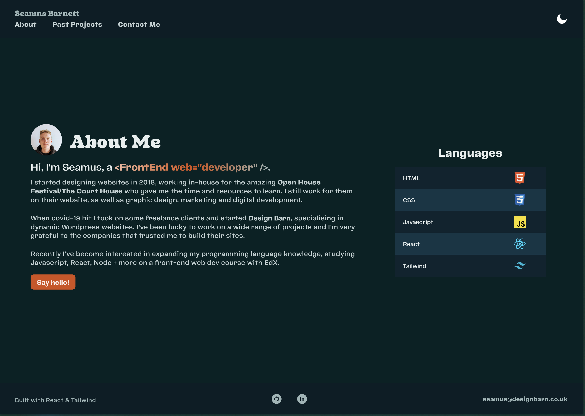
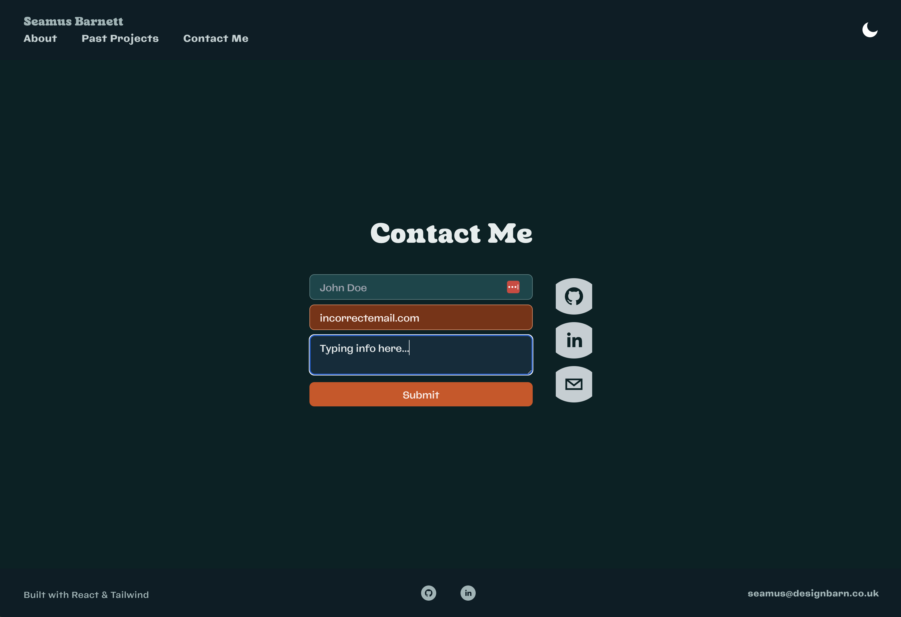

# Portfolio

## Description

**[View my portfolio](https://www.designbarn.co.uk)**

My personal portfolio, with a few words on me, examples of previous projects, and contact info.

I used React to create the site...

It features a dark mode, which saves user preference to local storage.

I used Tailwind to style the site. It works great for things like the contact form, which validates the email field and changes colour on focus/hover/validation.

## Credits

The portfolio uses third party components:
- [React Social Icons](https://www.npmjs.com/package/react-social-icons)
- [React Toggle Dark Mode](https://www.npmjs.com/package/react-toggle-dark-mode)
- [React Fluid Typography](https://www.npmjs.com/package/tailwind-fluid-typography)
- [getform (for contact form submission)](https://getform.io/)

## MIT License

A short and simple permissive license with conditions only requiring preservation of copyright and license notices. Licensed works, modifications, and larger works may be distributed under different terms and without source code.

## Questions

GitHub profile: <https://github.com/fawltya>

Feel free to **[email me](mailto:seamus@designbarn.co.uk)** about this repo.